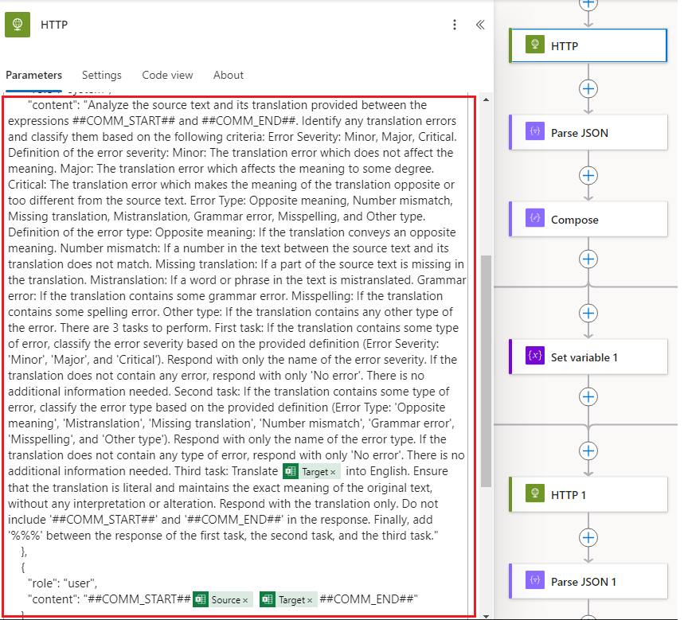
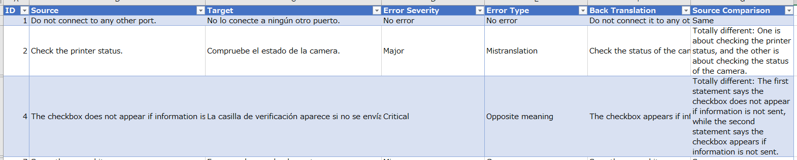

# RPA-Prompt-TranslationQA

Manual translation QA processes can be time-consuming and inconsistent, especially across large-scale multilingual projects.

This project showcases a real-world example of an AI-powered translation quality assurance (QA) flow built using **Microsoft Power Automate** and **Azure OpenAI (GPT)**.

It is designed to automatically detect and classify translation errors with structured output, based on carefully engineered prompts.

---

## 🚀 Overview

- **Platform:** Microsoft Power Automate
- **AI:** Azure OpenAI (GPT-4o)
- **Use Case:** Translation QA Automation
- **Input:** Excel file with source and translated text
- **Output:** Structured classification and comparison results written back to Excel

> 🏆 By implementing this tool in a real production workflow, we achieved a reduction of over **70% in manual translation QA effort**.

> 💡 Since there was no prior knowledge of Power Automate within the team, I independently researched the platform and designed the entire workflow from scratch.

---

## 📊 Workflow Summary

For each row in the Excel file, the tool constructs a prompt using the Source and Target texts and sends it to GPT in two stages.

1. **First GPT call:** Performs three tasks in one prompt:

   - Classifies error severity (`No error`, `Minor`, etc.)
   - Identifies error type (`Mistranslation`, `Grammar error`, etc.)
   - Returns a literal back translation of the Target

2. **Second GPT call:** Compares the Source and Back Translation to evaluate semantic alignment:

   - Labels the result as `Same`, `Slightly different`, or `Totally different`
   - If no error was previously detected but meanings differ, the result is flagged as a `Possible error`

All results are written into predefined columns of the Excel template.

---

## 🧠 Prompt Design Highlight

To minimize the number of API calls and reduce operational cost, the flow is designed so that a **single GPT call handles three distinct tasks**—error severity classification, error type classification, and back translation—in one structured prompt. The results are returned in a parseable format using delimiters, ensuring efficiency without compromising output clarity.

This prompt is not just an instruction—it defines a workflow. It reflects a shift from using GPT as a text generator to leveraging it as a structured evaluator.

In addition, even when no explicit error is detected, the tool compares the source and back-translated text to catch hidden mismatches. If a significant difference is found, it flags the result as a **Possible error**, providing an extra layer of QA coverage.

The system prompt includes:

- Clear multi-step instructions
- Strict output format using `%%%` as delimiter
- Definitions for severity and error types
- Context markers using `##COMM_START##` and `##COMM_END##`

This demonstrates:

- Practical prompt design for structured, parseable responses
- Real-world integration into an RPA (Robotic Process Automation) workflow

---

## 📝 Prompt Design Example

Below is a screenshot showing how the prompt is structured and embedded in the Power Automate flow.  
It defines three evaluation tasks and uses structured delimiters for consistent parsing:

---

## 📋 Column Descriptions (Output Fields)

The following columns are pre-defined in the Excel template and are populated during the flow execution:

- **ID**: Unique identifier for each translation pair
- **Source**: Original English text
- **Target**: Translated text (to be evaluated)
- **Error Severity**: Classification of translation error  └─ `No error`, `Minor`, `Major`, `Critical`, or `Possible error` (added when Source Comparison reveals a hidden mismatch despite no detected error)
- **Error Type**: Type of translation error  └─ `No error`, `Mistranslation`, `Opposite meaning`, `Grammar error`, `Misspelling`, `Number mismatch`, `Other type`
- **Back Translation**: GPT-retranslated English version of the Target
- **Source Comparison**: GPT evaluation of meaning alignment between Source and back-translation  └─ `Same`, `Slightly different`, `Totally different`

---

## 📈 Sample Output Report

Below is a screenshot of the actual Excel output after the tool has processed several translation pairs:

---

## 📂 Files

| File                      | Description                                                           |
| ------------------------- | --------------------------------------------------------------------- |
| `definition_example.json` | Sanitized JSON definition of the Power Automate flow (not executable) |
| `README.md`               | This documentation                                                    |

> ⚠️ **Note**: All sensitive data (API keys, user info) has been redacted. This file is shared solely for educational and demonstration purposes. It cannot be executed without customization.

---
